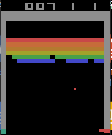
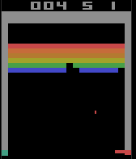
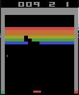
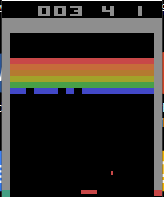
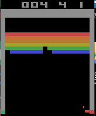

# MAS583 Project2

## Requirements

* Python <= 3.6 (Python3.6 is highly recommended)

## Installation

* Activate virtual environment
* Run command `make cpu_bootstrap` if you are using non-gpu machine
* Run command `make gpu_bootstrap` if you are using gpu machine

## Results

There are some results from our experiements

### DQN (Double DQN)

### Reward backpropagation PER (beta = 10)

### Moving Average Reward backpropagation PER (with beta = 5)

### Moving Average Reward backpropagation PER (with beta = 10)

### Windowed Reward backpropagation PER (with window size 1000)]

